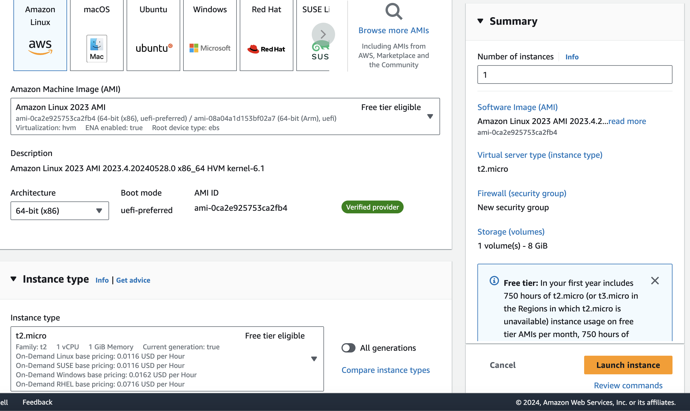

TODO: Fix steps - put more detail

This is a project that was meant to try out deployment options of a basic full-stack application. It's a single page website that outputs some comic books on the page with a few tabs to scroll through. I used this project to get a better understanding of some AWS services (EC2, Cloudfront, ECS, S3), CI/CD using Git Actions (with security scanners and IaC), Docker, basic networking.

Deployment options
- EC2/ S3 + Cloudfront
- ECS

1. Creating Simple Frontend and Backend  
To start off, I created the frontend and backend with Node.js and are in separate folders (for easier CI/CD and management). The backend fetches data from the [ComicVine API](https://comicvine.gamespot.com/api/documentation) and retrieves a list of comic book volumes from a single endpoint and runs on port 8000. The frontend makes a call to the backend, extracts certain fields like name, a jpg address, and the publisher, and outputs that on a page within a react card component. It also includes pagination so you can click through tabs.


2. CI with Github Actions  
During the creation of the website, I wanted to create a CI process to build and test the code every single time a commit was merged in the repo. There were a couple of workflows added.

The simplest section of the workflows is the building and testing steps in the [frontend and backend](https://github.com/DomDavis70/comic-viewer/blob/main/.github/workflows/frontend.yml). There are separate workflows for each for easier management.

Ex.
```
steps:
- uses: actions/checkout@v4

- name: Use Node.js ${{ matrix.node-version }}
  uses: actions/setup-node@v3
  with:
    node-version: ${{ matrix.node-version }}
    cache: 'npm'
    cache-dependency-path: './frontend/package-lock.json'

- run: npm ci
- run: npm run build --if-present
- run: npm test
```

The next workflow I wanted to configure is SAST and SCA scanning, although this would run in parallel to the 2 build/test workflows. The primary purpose of SAST and SCA scanners is to scan your source code for vulnerabilities. SAST (Static Application Security Scanning) is a white box testing method to scan your source code for an array of vulnerabilities such as, cross site scripting, SQL injection, buffer overflows etc. SCA (Software Composition Analysis) is a similar process, but scans for third party libraries and dependencies. 
Deciding on a security scanner was a little difficult, since there are a wide array of options. Some popular ones include SonarQube, Checkmarx, Veracode, Semgrep, Snyk, Whitesource etc. After doing some research and trial and error, I settled on Semgrep due to the free tier being easy to use. I needed to make an account and grab a security key to be able to integrate it into my pipeline. 

Integration (Had to add the token to my repo as a secret): 

```
  push:
    branches:
      - main
    paths:
      - .github/workflows/semgrep.yml
  schedule:
    # random HH:MM to avoid a load spike on GitHub Actions at 00:00
    - cron: '12 15 * * *'
jobs:
  semgrep:
    name: semgrep/ci
    runs-on: ubuntu-20.04
    env:
      SEMGREP_APP_TOKEN: ${{ secrets.SEMGREP_APP_TOKEN }}
    container:
      image: semgrep/semgrep
    if: (github.actor != 'dependabot[bot]')
    steps:
      - uses: actions/checkout@v3
      - run: semgrep ci
```
Everytime code is merged, a security report is sent to the Semgrep site for me to view. For example, here it caught 2 CVEs (Common Vunerabilities and Exposures) in my dependencies.


Next was to try and deploy this using EC2 for the backend and S3 + cloudfront for the frontend.
While creating the EC2, these are the basic settings I configured to make it as cheap as possible.


4. Create git hub workflow for frontend, backend, SAST and SCA scans, and container scans
5. Frontend:
    S3 creation: 
        Created a bucket called dom70-frontend-bucket
        Unchecked `Block All Access`
    
   Backend:
        EC2 Creation:
            created VPC, subnet, and security group
            after creation, I SSH into the EC2 instance by doing 
                `ssh -i key-file.pem ec2-user@<EC2-public-IP>`
                Once into the instance, I needed to test out commands to get the backend service running by running these commands:
                    ```sudo yum update -y
                    sudo yum install -y nodejs npm git
                    git clone https://github.com/DomDavis70/comic-viewer.git
                    cd comic-viewer
                    npm install
                    npm start```
                Now I can see the backend running!
            to automate this setup, I created a user scrpt on start up
   frontend:
        created a domain called comic-viewer.com
        create 2 a records. One for www.comic-viewer.com and comic-viewer.com
        Edit the front end to point to the EC2 IP address
        created 2 certificates for each a record
        setiing up cloudfront disribution - Redirect HTTP to HTTPS
    


